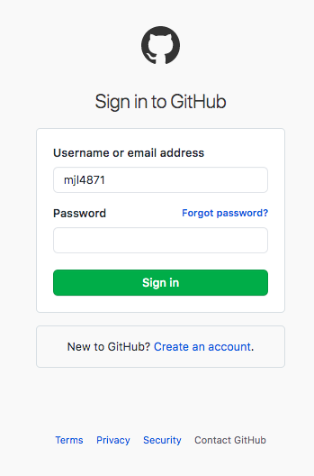
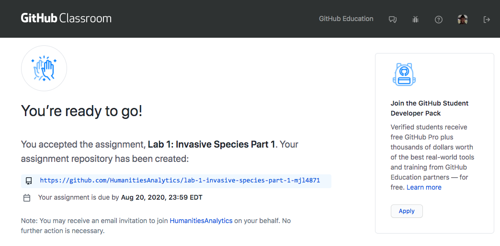
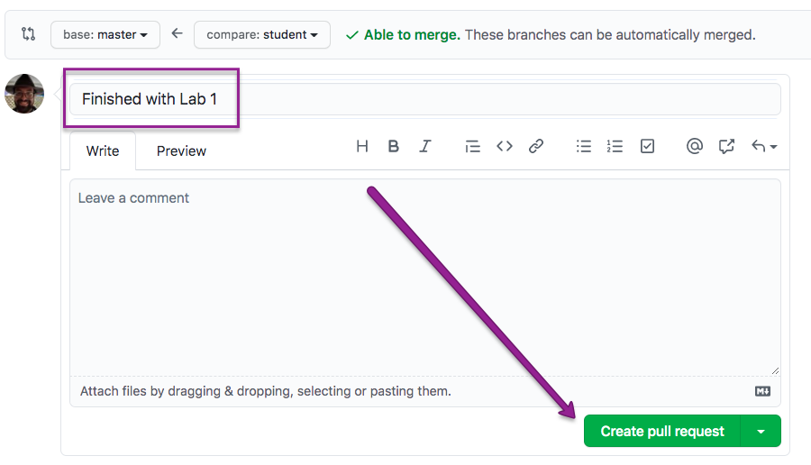

# DA 101 Lab Component 

To complete each lab assignment (individual or team) you will need a Github account, and you will need access to our Github Classroom, which I will provide once I have your Github username. Once you have access, you'll be able to click on the links below and create a Github repository cloned from the "starter code" I have provided in each lab repository. In each repository, you will find a `readme.md` file with instructions, as well as additional files and folders, such as any data sets needed to complete the lab. There will always be a file called `submission.r`, `submission.rmd`, or `submission.md`. 

## General Instructions

1. Click on on the Github Classroom Link for This Week's Lab
2. If prompted to sign into Github, do so
---

3. If asked to `Authorize GitHub Classroom`, click to authorize
---

4. Click the green button that says `Accept this assignment`
5. You will see a screen that says `You're ready to go!` On this page is a repo link and a due date (this repo is actually a fork of a Github template)
---

6. Visiting the repo link will bring you to a private Github repository at `https://github.com/humanitiesanalytics/[name of lab]-[your Github username]` (This will differ slightly for a team assignment.)
6. In this repo, you will see files and folders as described above
7. Just below the menu with  `<> Code` and `Issues`, you'll see an expandable icon that says `master`. If you click it, it will say `Switch branches/tags`. Below that, in the field that says `find or create a branch`, type the word student and press enter. This will create a new branch called `student`, and you should now see a notification that says `3 branches` instead of `2 branches`
---

8. Click on the text that says `3 branches` or go to `[your Repo address]/branches` and select `change default branch`. Select the `student` branch as the default so that future edits are committed to that branch.
---

9. You and your teammates can now add and edit files. Each time you make a change, you will asked to commit changes and leave an optional commit message. These messages can be as simple as "initial commit," but you can also use them to keep track of which changes you are making.
10. When you are done with the assignment, click on the menu link for `Pull Requests` and click the green link that says `make a new pull request`. Choose `master` as the base branch and `student` as the comparison branch. In your commit message, write something like "finished" or "lab 1 completed". Making this pull request will generate an email that lets me know you're ready for feedback. 
---

These instructions have several steps, but each one is relatively easy, and I promise you'll get used to it. On the plus side, knowing some git/Github will pay big dividends in the future (employment, riches, the admiration of your peers, you name it). If anything goes sideways, you can always email me or our TA for help. 

## Command Line Github 

If you have used Github before, you will be able to clone the repository to your desktop, make changes, commit, and push much like you would with a normal Github repository, with a couple of minor exceptions that I am happy to help you learn. If you haven't used Github before, you can write your code in RStudio and then copy/paste it to the submission file. Once your work is complete

## Links to Individual Labs

|Lab                              | Github Classroom Link                     |
|---------------------------------|-------------------------------------------|
|Lab 0: Installations             |  https://classroom.github.com/a/t5-Ymjpr  |
|Lab 1: Invasive Species Part 1   |  https://classroom.github.com/a/yzDtOjA_  |
|Lab 2: Collecting and Coding Data | https://classroom.github.com/a/nYcV-MOo  |
|Lab 3: Invasive Species Part 2   |  https://classroom.github.com/g/gaKfTXdW  |
